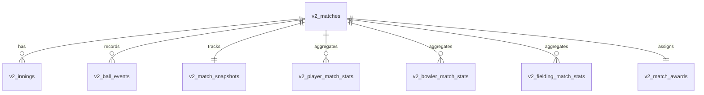

# CricEngine V2 – Technical Architecture Document

CricEngine V2 is the unified, offline-first cricket scoring engine powering CricLab. This document outlines its database schema, core service layers, scoring flow, backup format, and recovery mechanisms.

---

## 1. Database Schema Specification

All CricEngine V2 database tables are prefixed with `v2_` and reside within the SQLite container.



### Table: `v2_matches`
Represents the core match metadata.
* `id` (TEXT PRIMARY KEY): Unique UUID of the match.
* `team_a_id` / `team_b_id` (TEXT): Team foreign keys.
* `overs` (INTEGER): Match length in overs.
* `wide_run` / `noball_run` (INTEGER): Runs awarded for wide/no-ball extras.
* `match_type` (TEXT): Format (T20, ODI, custom).
* `ground` (TEXT): Venue name.
* `match_date` (TEXT): ISO timestamp.
* `status` (TEXT): `upcoming`, `live`, or `past`.
* `result` (TEXT): Text summarizing result.
* `batting_first_id` (TEXT): Team batting first.
* `current_innings` (INTEGER): `1` or `2`.
* `last_man_batting` (INTEGER): `1` or `0` flag.

### Table: `v2_innings`
Tracks the status and total scores for each innings.
* `id` (TEXT PRIMARY KEY): `${match_id}_inn_${innings_no}`.
* `match_id` (TEXT REFERENCES v2_matches).
* `innings_no` (INTEGER): `1` or `2`.
* `batting_team_id` / `bowling_team_id` (TEXT).
* `runs` / `wickets` / `legal_balls` (INTEGER).
* `is_closed` (INTEGER): `1` or `0`.

### Table: `v2_ball_events`
The immutable event log. Every scoring action writes a row here.
* `event_uuid` (TEXT PRIMARY KEY): Unique event identifier.
* `match_id` (TEXT REFERENCES v2_matches).
* `innings_no` / `over_no` / `ball_no` (INTEGER).
* `striker_id` / `non_striker_id` / `bowler_id` (TEXT).
* `runs_off_bat` / `extras` (INTEGER).
* `extra_type` (TEXT): `wide`, `no_ball`, `bye`, `leg_bye`, or `penalty`.
* `wicket` (INTEGER): `1` or `0`.
* `wicket_type` (TEXT): `bowled`, `caught`, `run_out`, `lbw`, `stumped`, etc.
* `dismissed_player_id` (TEXT).
* `timestamp` (INTEGER): Epoch timestamp.
* `device_id` (TEXT).
* `sequence_number` (INTEGER): Order index.
* `version` (INTEGER): Increments upon corrections.
* `metadata` (TEXT): JSON field for extra parameters (e.g. catch taker).
* `superseded_by` (TEXT): Pointer to correcting event UUID.
* `is_superseded` (INTEGER): `1` if overridden by a correction, `0` otherwise.

### Table: `v2_match_snapshots`
The cached current state of the match for rapid UI rendering.
* Includes current batter IDs, bowler, partnership runs/balls, runs required, run rate, target, and projected score.

### Tables: `v2_player_match_stats` & `v2_bowler_match_stats`
Aggregated per-match metrics for players and bowlers.
* Updated atomically by the recovery engine or upon event commits.

---

## 2. Core Service Directory

```text
src/engine/v2/
├── database/
│   └── schema.ts           # Schema definition and initialization queries
├── services/
│   ├── backupService.ts    # Native JSON export/import & restore routines
│   ├── matchCompletion.ts # Win/result calculation and awards generation
│   ├── matchRecovery.ts   # Replays ball logs to rebuild stats and snapshots
│   └── snapshotRecovery.ts# Reconstructs current match snapshot
```

---

## 3. scoring flow & State Transitions

1. **Scoring Action**: A ball event is recorded on the UI.
2. **Transaction Commit**:
   * Insert event into `v2_ball_events`.
   * Trigger `SnapshotRecoveryService.rebuildSnapshot(matchId)` to run a transactional database rebuild of the current over, partnership, and match scoreboard.
   * Atomic update of player stats and bowler stats.
3. **UI Renders**: Reads directly from `v2_match_snapshots` and display-ready statistics.

---

## 4. Undo and Correction Architecture

* **Undo**: Marks the latest active `v2_ball_event` as superseded (`is_superseded = 1`) and calls `SnapshotRecoveryService.rebuildSnapshot()`.
* **Correction**: Overwrites parameters on an event by creating a new version pointing to the old one. The recovery service recalculates everything from the ground up by replaying only the non-superseded events sequentially.

---

## 5. Offline Backup & Restore Format

Backups are stored as a JSON payload in standard Capacitor directory (`Documents/CricLab/Backups/`).

### JSON Payload Structure
```json
{
  "backupVersion": 2,
  "matchId": "uuid-here",
  "match": { ... },
  "innings": [ ... ],
  "ballEvents": [ ... ],
  "squads": [ ... ],
  "snapshots": [ ... ],
  "awards": [ ... ]
}
```

### Restore Strategies
* **Merge**: Upserts missing rows without modifying local matches under active scoring.
* **Replace**: Performs a destructive wipe and rebuilds from the backup snapshot.
